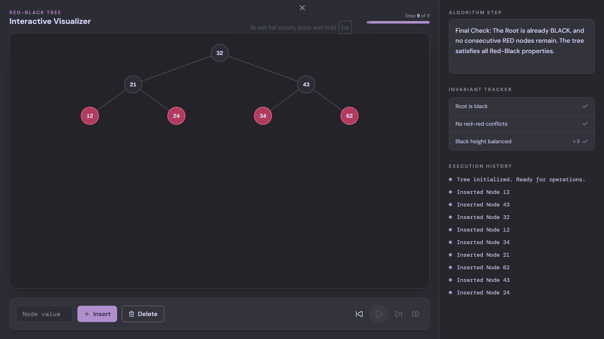

# Red-Black Tree Visualizer

An interactive, step-by-step visualizer for Red-Black Tree insertion and deletion. Every rotation, recoloring, and fixup case is animated and narrated in plain language, so you can watch the algorithm restore its invariants one step at a time instead of just reading pseudocode.

**Live demo:** [rbt-visualizer.vercel.app](https://rbt-visualizer.vercel.app/)



## Features

- **Full insert & delete** — a complete CLRS-style implementation, including all rotation and recoloring cases for both `insertFixup` and `deleteFixup`.
- **Step-by-step playback** — scrub through every intermediate state of an operation with play/pause, step forward/back, jump-to-start, and jump-to-end controls.
- **Plain-language narration** — each step explains *what* is happening and *why*, from the initial BST search down to the specific fixup case being applied.
- **Live invariant tracker** — a running check of the three Red-Black properties (root is black, no red-red conflicts, and a consistent black-height) that updates on every step, so you can see exactly when a violation appears and when it's resolved.
- **Execution history** — a session log of every operation performed on the tree.
- **Animated tree layout** — nodes and edges animate smoothly between states using Framer Motion, with active nodes highlighted at each step.


## Tech stack

| Layer | Tool |
|---|---|
| Framework | Next.js (App Router) + React |
| Language | TypeScript |
| Styling | Tailwind CSS |
| Animation | Framer Motion |
| Icons | lucide-react |
| Font | [DM Sans](https://fonts.google.com/specimen/DM+Sans) / DM Mono |

## Getting started

```bash
# install dependencies
npm install

# run the dev server
npm run dev
```

Then open [http://localhost:3000](http://localhost:3000) in your browser.

## Project structure

```
.
├── app/
│   └── page.tsx                  # entry point, renders the visualizer
├── components/
│   ├── RedBlackTreeVisualizer.tsx  # UI shell: controls, sidebar, invariant tracker
│   └── TreeCanvas.tsx              # SVG rendering & layout of the tree
└── lib/
    └── rbt.ts                      # Red-Black Tree engine (insert, delete, rotations, snapshots)
```

### How the animation works

The tree engine (`lib/rbt.ts`) never renders anything directly. Instead, every meaningful mutation — a comparison, a recolor, a rotation — calls `takeSnapshot()`, which deep-clones the current tree state along with a human-readable message and the IDs of any nodes involved in that step. An `insert()` or `delete()` call returns the full array of snapshots for that operation, and the UI simply steps through them. This keeps the algorithm implementation and the animation timeline completely decoupled.

## Design

The interface uses a custom dark palette purpose-built for this project, paired with DM Sans for UI text and a monospace face for node values and logs to keep data visually distinct from narration.

| Color | Hex | Usage |
|---|---|---|
| ⬛ | `#2C2C34` | App background, black nodes |
| ⬛ | `#494850` | Panels, borders, edges |
| ⬛ | `#978897` | Muted text, secondary states |
| 🟪 | `#B18FCF` | Primary accent, active highlights |
| ⬜ | `#D8D8F6` | Primary text, emphasis |

## Roadmap

- [ ] Bulk import (build a tree from a list of values at once)
- [ ] Adjustable playback speed
- [ ] Export the current tree state as an image

## License

MIT
